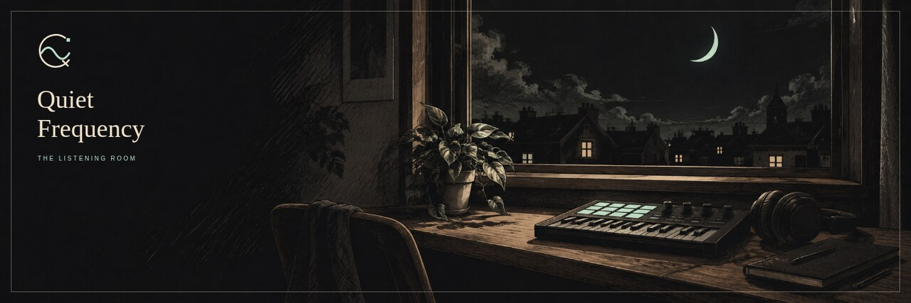

  

  

<h1 align="center">0xQuan</h1>

  <strong>Quan</strong> builds.&nbsp;&nbsp;<strong>Zephyr</strong> keeps the machine honest. 
  A local-first Omarchy workshop with music coming through the walls.

  
  
  
  
  

I keep a personal Linux studio on [Omarchy](https://omarchy.org): native desktop tools, musical identity research, and a companion named **Zephyr** who lives on the glass rather than in the cloud. Public repositories are the parts that can travel. The machine-only overlay stays here.

Zephyr's public familiar is **[Wisp](https://github.com/0xQuan93/omarchy-pixel-spirit)** — a Quickshell companion with a pocket room and a themed dream-room screensaver. Quan is also **0xQuan** on WaveWarZ.

## Now

- **[WavID](https://github.com/0xQuan93/WavID)** — MIT Browser Studio 0.2: verifiable creative history as living visual identity, handed off for WaveWarz review.
- **[omarchy-skills](https://github.com/0xQuan93/omarchy-skills)** — a public catalog and learning journal of Omarchy agent skills, updated as new shareable skills land.
- Native Omarchy widgets, themes, and a local-first music/video workshop (Resonant, Q-cut) on the machine itself.

## Public workshop

| Repository | What it is | Topics |
| --- | --- | --- |
| [WavID](https://github.com/0xQuan93/WavID) | Deterministic musical identity on the visitor's device. No generation backend. | `music` `identity` `generative-art` `typescript` |
| [omarchy-pixel-spirit](https://github.com/0xQuan93/omarchy-pixel-spirit) | Wisp — native Omarchy machine familiar. Sixteen forms, local AI, pocket room. | `omarchy` `hyprland` `quickshell` `qml` `linux-desktop` |
| [omarchy-extras](https://github.com/0xQuan93/omarchy-extras) | Pick-and-choose desktop plugins, dashboard, media tools, Regalia ’89 theme. | `omarchy` `hyprland` `quickshell` `linux-desktop` |
| [omarchy-skills](https://github.com/0xQuan93/omarchy-skills) | Reusable agent skills plus a dated journal of what was actually verified. | `omarchy` `agent-skills` `ai-agents` `linux` |
| [omarchy-sync-01-theme](https://github.com/0xQuan93/omarchy-sync-01-theme) | Unofficial Evangelion-inspired Omarchy theme. Registry validator-clean. | `omarchy-theme` `linux` `hyprland` |
| [poselabstudio](https://github.com/0xQuan93/poselabstudio) | Browser studio for VRM posing, animation, and local-first avatar content. | `vrm` `threejs` `typescript` `avatars` |

Standard GitHub issue labels (`bug`, `enhancement`, `documentation`, `good first issue`, `help wanted`, `accessibility`) are on the maintained public repos. Topics on each repository are the discovery tags.

## Stack

Linux (Arch / Omarchy) · Hyprland · Quickshell / QML · TypeScript · Python · Three.js · Remotion · local models when they earn their keep.

## Also on this account

- [ArtistOS](https://github.com/0xQuan93/artist-os) — local-first artist command environment for music, visuals, and assets.
- [PoseLab](https://poselab.studio) — live demo of the VRM studio.
- [Project 89 Arsenal](https://github.com/0xQuan93/Project89-Arsenal) and the [89 Validator Handbook](https://github.com/0xQuan93/89-Validator-Handbook) — earlier community infrastructure work.
- [VIPE-CITY](https://github.com/0xQuan93/VIPE-CITY) — assets gifted to that community and kept for posterity.

## Contact

- GitHub: [0xQuan93](https://github.com/0xQuan93)
- X: [@_0xQuan](https://x.com/_0xQuan)
- PoseLab: [poselab.studio](https://poselab.studio)

Issues and PRs are welcome on the public workshop repos. Say what you verified.

---

<em>Quiet Frequency · The Listening Room</em>

